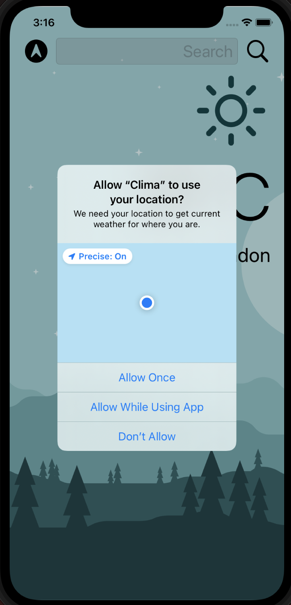
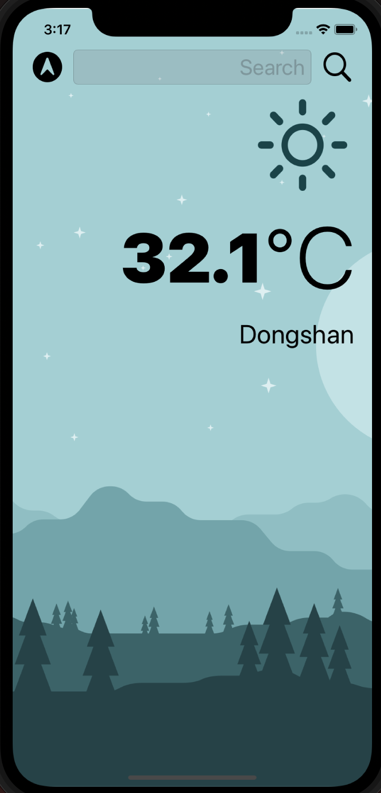
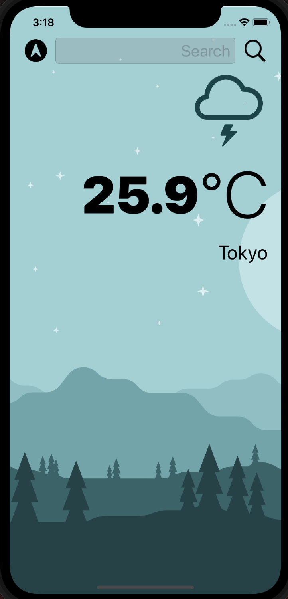
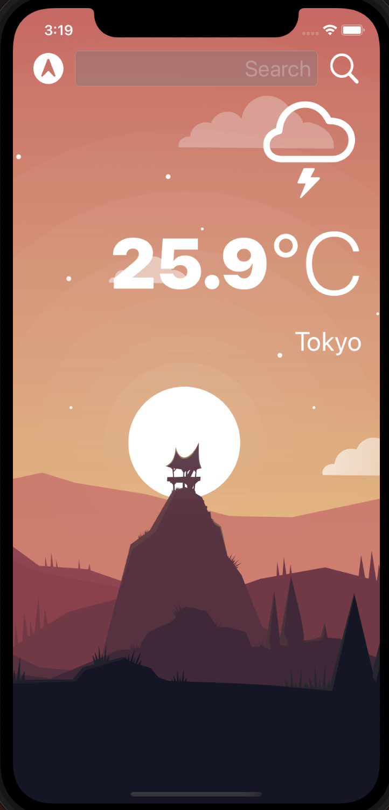

# Clima
A easy app which can fetch the specific country's weather.\
Also, fetching the local weather is available.

## Demo
| Ask Access for Location | Display Location Weather |
| --- | --- |
|  |  |

| Search Weather (Before) | Search Weather (After) | Switch to Darkmode |
| --- | --- | --- |
|  |  |  |

## How to run the app
1. git clone or download the project
2. open Clima.xcodeproj and run the app on the simulator
